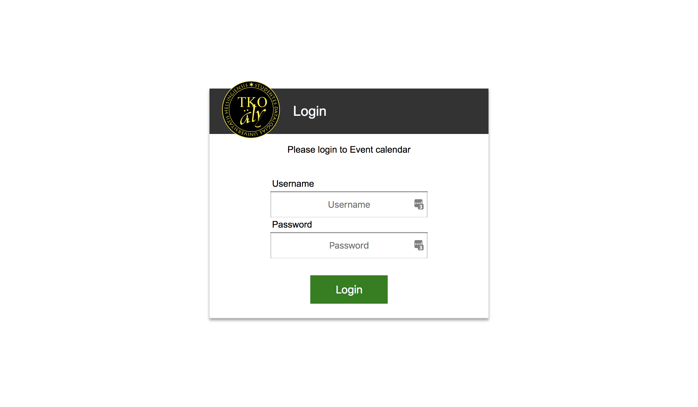
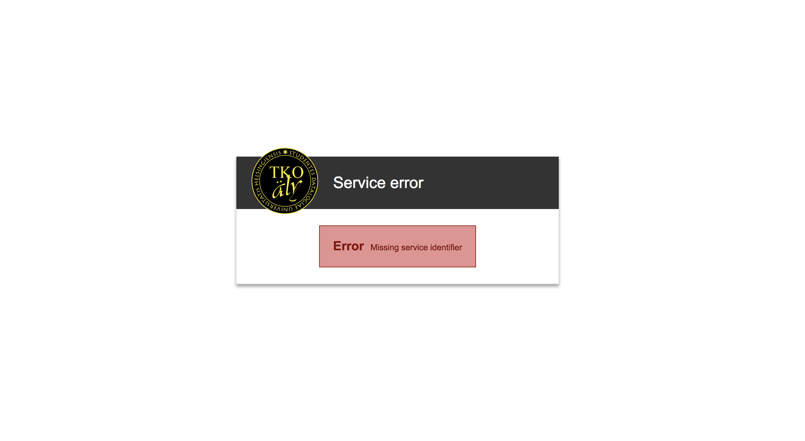
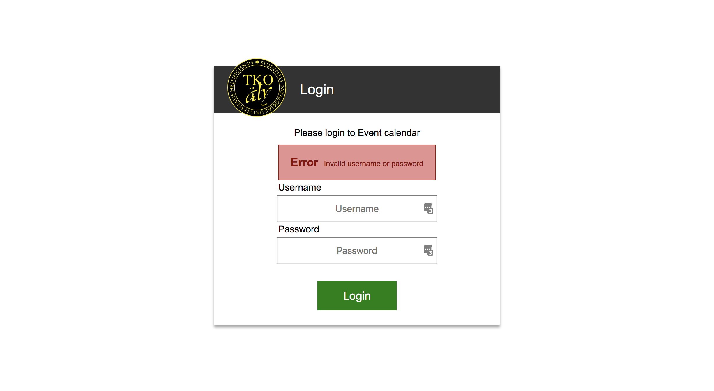
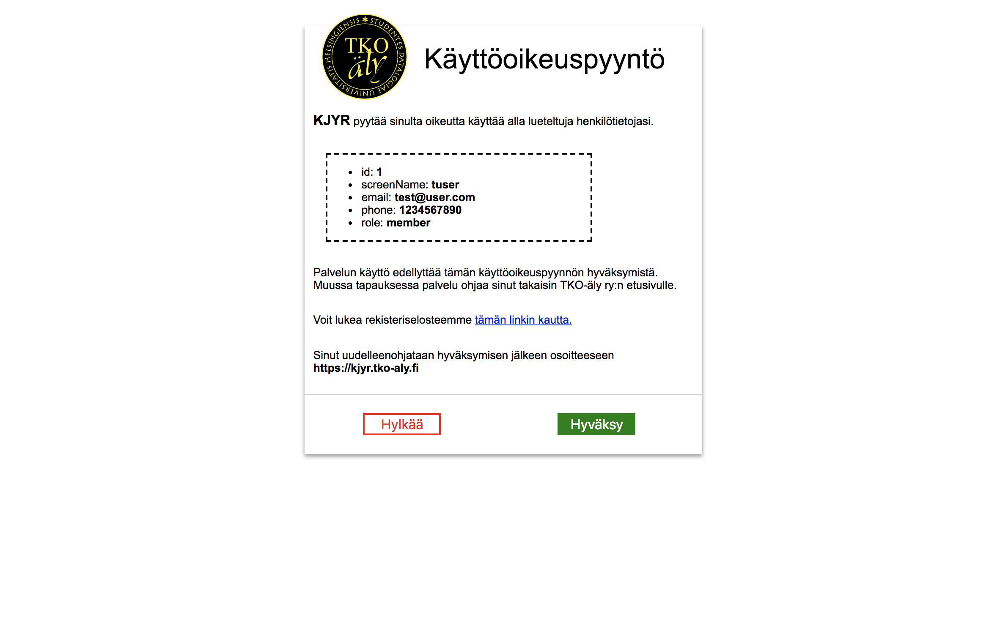

# TKO-äly user service


[](https://travis-ci.org/TKOaly/user-service)

Test coverage (master) [](https://codecov.io/gh/TKOaly/user-service)

Test coverage (dev) [](https://codecov.io/gh/TKOaly/user-service)


[](path/to/linked/page)
[](path/to/linked/page)

[](https://github.com/ellerbrock/typescript-badges/)


[](https://github.com/TKOaly/user-service/issues)


Microservice for authenticating users of members.tko-aly.fi.

<!-- START doctoc generated TOC please keep comment here to allow auto update -->
<!-- DON'T EDIT THIS SECTION, INSTEAD RE-RUN doctoc TO UPDATE -->
<!-- DON'T EDIT THIS SECTION, INSTEAD RE-RUN doctoc TO UPDATE -->

- [Documentation](#documentation)
- [Installation instructions](#installation-instructions)
- [Endpoints](#endpoints)
  - [`GET /?serviceIdentifier={service identifier}`](#get-serviceidentifierservice-identifier)
  - [`POST /api/auth/requestPermissions`](#post-apiauthrequestpermissions)
  - [`GET /api/users/me?dataRequest={data request bitfield}`](#get-apiusersmedatarequestdata-request-bitfield)

<!-- END doctoc generated TOC please keep comment here to allow auto update -->

## Documentation

[Documentation generated by Typedoc here](https://htmlpreview.github.io/?https://github.com/TKOaly/user-service/blob/master/doc/index.html)

## Installation instructions

1.  Clone the repo

(Optional: Run `nvm install` and `nvm use` to install the correct Node version. This requires Node Version Manager (NVM) to be installed)

2.  Run `yarn install`
3.  Copy `.env.example` to `.env` and set environment variables
4.  Run `yarn test` to run unit & API tests. Run `yarn browser-test` to run E2E tests.
5.  Run `yarn start` or `yarn watch``

### Updating package-lock.json for production

The Dockerfile uses npm (and our very specific `package-lock.json` configuration).  
Make sure to run `npm install` before pushing, if you have new dependencies.

## Pushing to TKO-äly's Docker registry

1. Clone the repo
2. Copy `.env.deploy.example` to `.env.deploy` and set your Docker credentials
3. Run `chmod +x ./deploy-container.sh` and after that, run `./deploy-container.sh`

This will build the image and push it to `registry.tko-aly.fi` Docker registry.

### Docker

1. `docker-compose up -d`. Now you can check adminer http://localhost:8081 (uname: root, pw: unsecure). The service is running at http://localhost:8080.
2. `docker-compose run web yarn migrate`.
3. `docker-compose run web yarn seed`.
4. Boom, you should be ready to tyckittää.

## Endpoints

### `GET /?serviceIdentifier={service identifier}`

Shows the user a login form, that authenticates to a service identified by the service identifier. If the user is already authenticated to the service, the form will redirect the user to the service specified.



If the user does not input a service identifier, the following view is shown:



If the login fails, the following view is shown:



After clicking login, the user is redirected to the permission prompt page:



### `POST /api/auth/requestPermissions`

Authenticates a user with username, password and a service identifier. It returns a authorization token which can be used to fetch user information.

Example of form POST body:

```json
{
  "username": "hugeli",
  "password": "1234",
  "serviceIdentifier": "12a0058d-f9aa-1e22-b01a-6025700dab1f"
}
```

The response of this request is a form verifying what user information is used in that service (services are identified by an unique service idenfitier.)

### `GET /api/users/me?dataRequest={data request bitfield}`

The `dataRequest` query parameter is required. It is a bitfield which values are 2 ^ the [User](/src/models/User.ts) model's attribute index.

If I wan't to get the id, name and email of a user, I do `Math.pow(2, 0) | Math.pow(2, 2) | Math.pow(2, 4)`, then insert that value into the dataRequest query. It would return:

Example response:

```json
{
  "ok": true,
  "message": "Success",
  "payload": {
    "id": 420,
    "name": "Bob John",
    "email": "asd@asd.com"
  }
}
```
